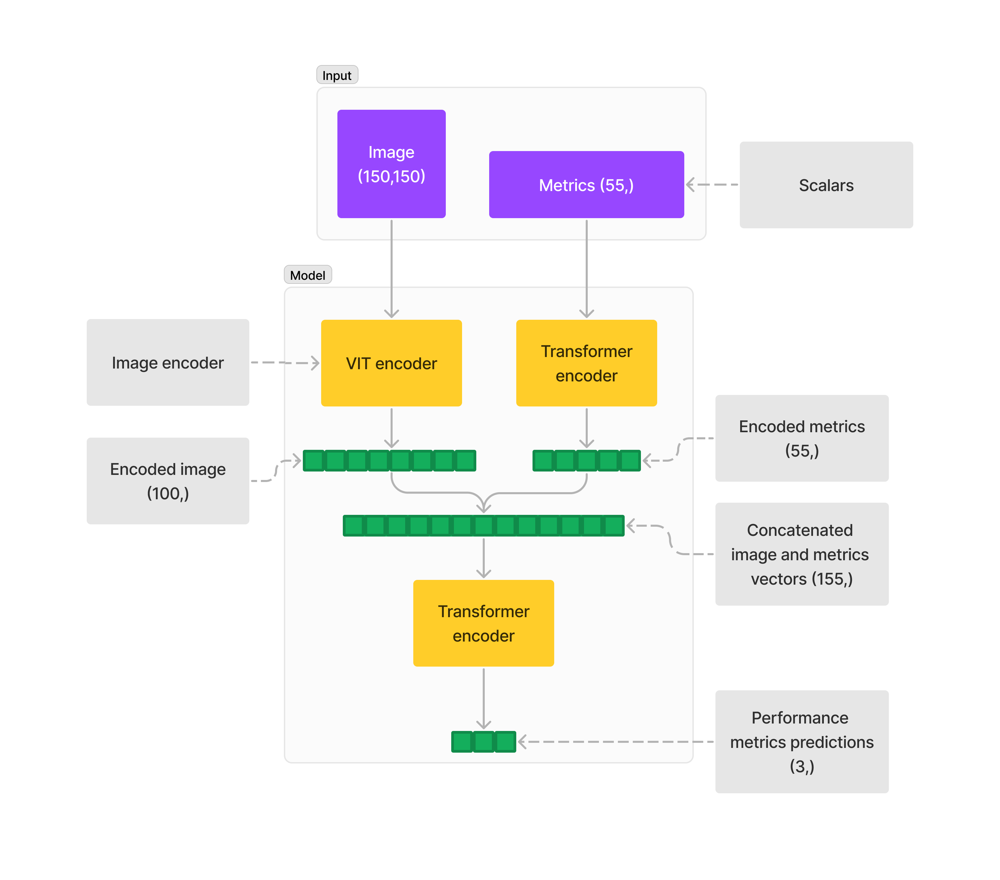
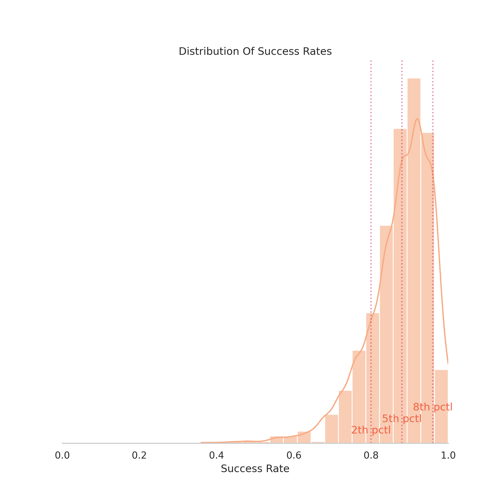
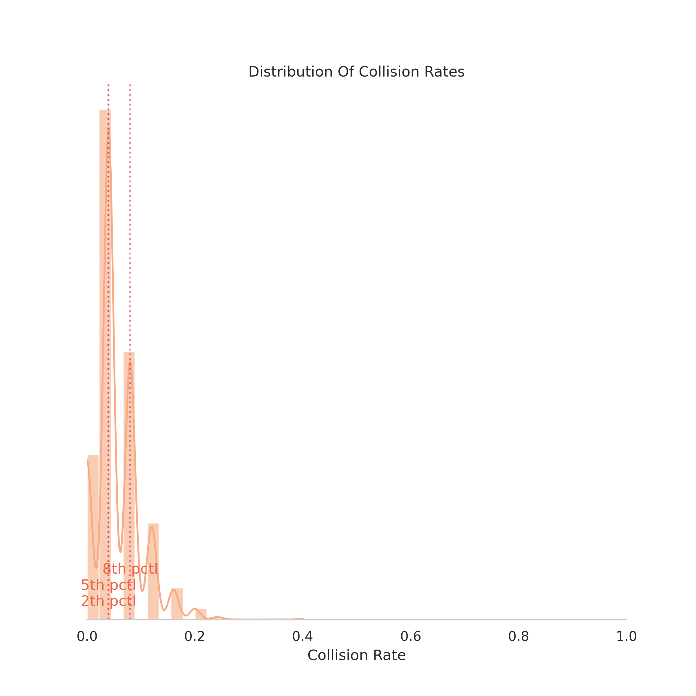
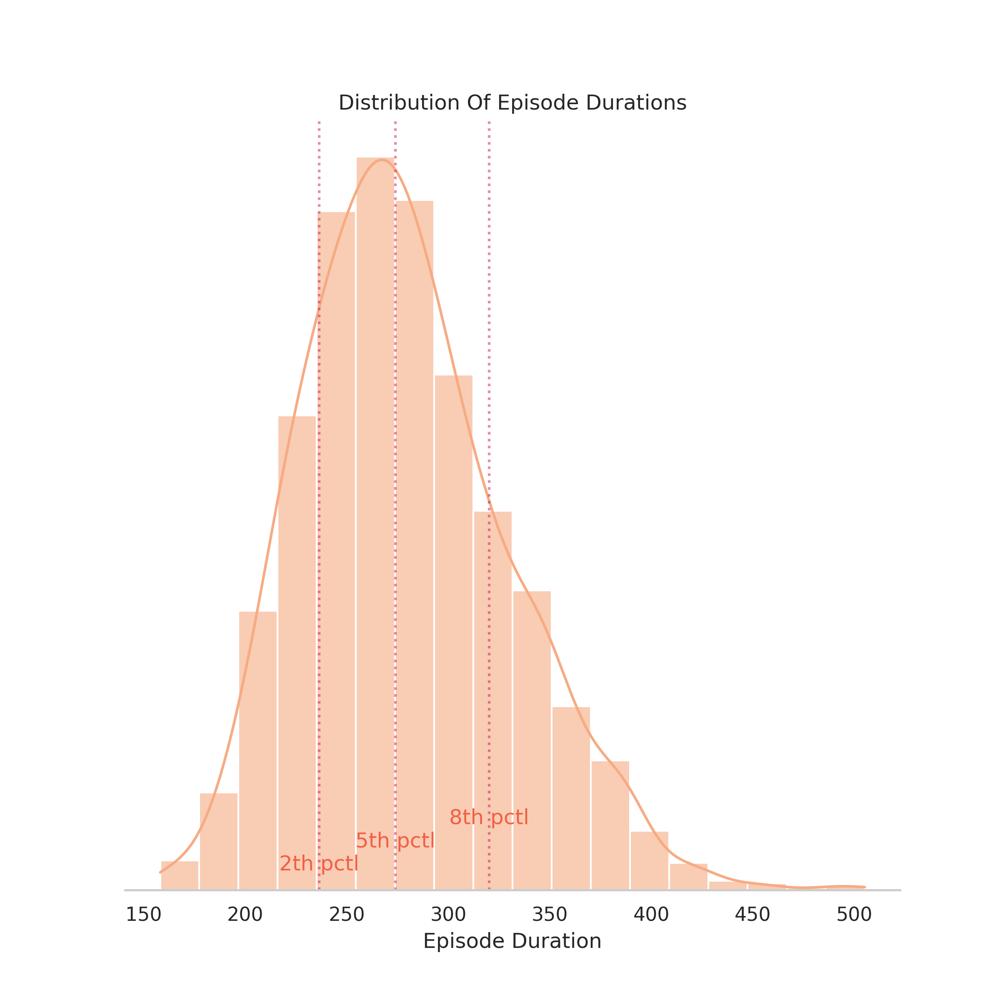
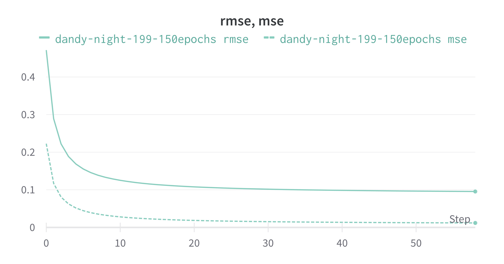
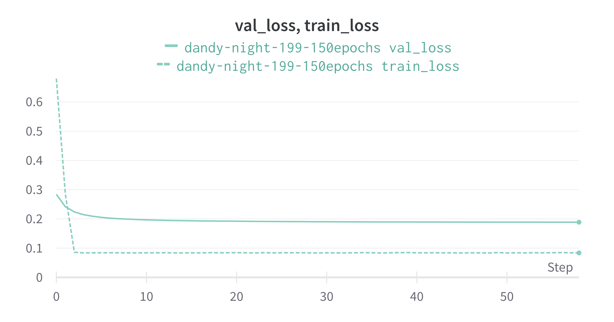

# Navigation robot prediction project

## Introduction

This project is a neural network that predicts the success rate 
of a robot moving from one point to another in a given map.


## Model architecture (Bird's eye view)



### Model summary
```text
=========================================================================================================
Layer (type:depth-idx)                                  Output Shape              Param #
=========================================================================================================
NavModel                                                [20, 1]                   --
├─ViTransformerWrapper: 1-1                             [20, 100]                 90,100
│    └─Linear: 2-1                                      [20, 900, 100]            2,600
│    └─Identity: 2-2                                    [20, 900, 100]            --
│    └─Dropout: 2-3                                     [20, 900, 100]            --
│    └─Encoder: 2-4                                     [20, 900, 100]            --
│    └─LayerNorm: 2-5                                   [20, 900, 100]            200
│    └─Identity: 2-6                                    [20, 100]                 --
├─Encoder: 1-2                                          [20, 1, 55]               --
├─Sequential: 1-3                                       [20, 1]                   --
│    └─TransformerEncoderLayer: 2-7                     [20, 155]                 --
│    │    └─MultiheadAttention: 3-1                     [20, 155]                 96,720
│    │    └─Dropout: 3-2                                [20, 155]                 --
│    │    └─LayerNorm: 3-3                              [20, 155]                 310
│    │    └─Linear: 3-4                                 [20, 2048]                319,488
│    │    └─Dropout: 3-5                                [20, 2048]                --
│    │    └─Linear: 3-6                                 [20, 155]                 317,595
│    │    └─Dropout: 3-7                                [20, 155]                 --
│    │    └─LayerNorm: 3-8                              [20, 155]                 310
│    └─Linear: 2-8                                      [20, 100]                 15,600
│    └─ReLU: 2-9                                        [20, 100]                 --
│    └─TransformerEncoderLayer: 2-10                    [20, 100]                 --
│    │    └─MultiheadAttention: 3-9                     [20, 100]                 40,400
│    │    └─Dropout: 3-10                               [20, 100]                 --
│    │    └─LayerNorm: 3-11                             [20, 100]                 200
│    │    └─Linear: 3-12                                [20, 2048]                206,848
│    │    └─Dropout: 3-13                               [20, 2048]                --
│    │    └─Linear: 3-14                                [20, 100]                 204,900
│    │    └─Dropout: 3-15                               [20, 100]                 --
│    │    └─LayerNorm: 3-16                             [20, 100]                 200
│    └─Linear: 2-11                                     [20, 100]                 10,100
│    └─ReLU: 2-12                                       [20, 100]                 --
│    └─Dropout: 2-13                                    [20, 100]                 --
│    └─TransformerEncoderLayer: 2-14                    [20, 100]                 --
│    │    └─MultiheadAttention: 3-17                    [20, 100]                 40,400
│    │    └─Dropout: 3-18                               [20, 100]                 --
│    │    └─LayerNorm: 3-19                             [20, 100]                 200
│    │    └─Linear: 3-20                                [20, 2048]                206,848
│    │    └─Dropout: 3-21                               [20, 2048]                --
│    │    └─Linear: 3-22                                [20, 100]                 204,900
│    │    └─Dropout: 3-23                               [20, 100]                 --
│    │    └─LayerNorm: 3-24                             [20, 100]                 200
│    └─Linear: 2-15                                     [20, 80]                  8,080
│    └─ReLU: 2-16                                       [20, 80]                  --
│    └─TransformerEncoderLayer: 2-17                    [20, 80]                  --
│    │    └─MultiheadAttention: 3-25                    [20, 80]                  25,920
│    │    └─Dropout: 3-26                               [20, 80]                  --
│    │    └─LayerNorm: 3-27                             [20, 80]                  160
│    │    └─Linear: 3-28                                [20, 2048]                165,888
│    │    └─Dropout: 3-29                               [20, 2048]                --
│    │    └─Linear: 3-30                                [20, 80]                  163,920
│    │    └─Dropout: 3-31                               [20, 80]                  --
│    │    └─LayerNorm: 3-32                             [20, 80]                  160
│    └─Linear: 2-18                                     [20, 70]                  5,670
│    └─ReLU: 2-19                                       [20, 70]                  --
│    └─TransformerEncoderLayer: 2-20                    [20, 70]                  --
│    │    └─MultiheadAttention: 3-33                    [20, 70]                  19,880
│    │    └─Dropout: 3-34                               [20, 70]                  --
│    │    └─LayerNorm: 3-35                             [20, 70]                  140
│    │    └─Linear: 3-36                                [20, 2048]                145,408
│    │    └─Dropout: 3-37                               [20, 2048]                --
│    │    └─Linear: 3-38                                [20, 70]                  143,430
│    │    └─Dropout: 3-39                               [20, 70]                  --
│    │    └─LayerNorm: 3-40                             [20, 70]                  140
│    └─Linear: 2-21                                     [20, 60]                  4,260
│    └─ReLU: 2-22                                       [20, 60]                  --
│    └─TransformerEncoderLayer: 2-23                    [20, 60]                  --
│    │    └─MultiheadAttention: 3-41                    [20, 60]                  14,640
│    │    └─Dropout: 3-42                               [20, 60]                  --
│    │    └─LayerNorm: 3-43                             [20, 60]                  120
│    │    └─Linear: 3-44                                [20, 2048]                124,928
│    │    └─Dropout: 3-45                               [20, 2048]                --
│    │    └─Linear: 3-46                                [20, 60]                  122,940
│    │    └─Dropout: 3-47                               [20, 60]                  --
│    │    └─LayerNorm: 3-48                             [20, 60]                  120
│    └─Linear: 2-24                                     [20, 40]                  2,440
│    └─ReLU: 2-25                                       [20, 40]                  --
│    └─TransformerEncoderLayer: 2-26                    [20, 40]                  --
│    │    └─MultiheadAttention: 3-49                    [20, 40]                  6,560
│    │    └─Dropout: 3-50                               [20, 40]                  --
│    │    └─LayerNorm: 3-51                             [20, 40]                  80
│    │    └─Linear: 3-52                                [20, 2048]                83,968
│    │    └─Dropout: 3-53                               [20, 2048]                --
│    │    └─Linear: 3-54                                [20, 40]                  81,960
│    │    └─Dropout: 3-55                               [20, 40]                  --
│    │    └─LayerNorm: 3-56                             [20, 40]                  80
│    └─Linear: 2-27                                     [20, 1]                   41
│    └─TransformerEncoderLayer: 2-28                    [20, 1]                   --
│    │    └─MultiheadAttention: 3-57                    [20, 1]                   8
│    │    └─Dropout: 3-58                               [20, 1]                   --
│    │    └─LayerNorm: 3-59                             [20, 1]                   2
│    │    └─Linear: 3-60                                [20, 2048]                4,096
│    │    └─Dropout: 3-61                               [20, 2048]                --
│    │    └─Linear: 3-62                                [20, 1]                   2,049
│    │    └─Dropout: 3-63                               [20, 1]                   --
│    │    └─LayerNorm: 3-64                             [20, 1]                   2
=========================================================================================================
Total params: 4,873,519
Trainable params: 4,873,519
Non-trainable params: 0
Total mult-adds (M): 90.78
=========================================================================================================
```


## Prerequisites
- Python ~= 3.10.4
- poetry ~= 1.1.14
- CUDA enabled NVIDIA GPU with at least 11GiB of memory
- CUDA Toolkit Version: 11.7 
- Tested on Ubuntu 22.04.1 LTS. (jammy)

## About the dataset
The dataset is a collection of maps and their corresponding navigation metrics and navigation goals.
In the code, the map is termed as `img` and the navigation metrics are termed as `meta` or `metadata`
, while the navigation goals are termed as `target`.

- YAML files structure is one level deep, key value pairs where the value is always a float. The keys always named using snake case.
- We use UUID4 as the map identifier. Additionally, every file is named as `<uuid>_<file-name>.yml`.
- The total number of metric parameters (`metadata`) is `55` and the total number of goals (`target`) is `3`.
- Target parameters are stored in the `<UUID4>_performance_metrics.yml`.
- The image dimensions are `150x150` and the image is stored as a `PNG` file.
- The map image files always have the postfix `_map.png`. 

## Analysis

The dataset contains 3 performance metrics for each map. The metrics are: 
- `success_rate`
- `collision_rate`
- `episode_duration`

We found that the `success_rate`, `collision_rate`, and `episode_duration` are not evenly distributed. This is shown in the following figures.



To simplify debugging process, we decided to use the `success_rate` as the target and to exclude the `collision_rate` 
and `episode_duration`. After several epochs, the model predictions of the `success_rate` converged to a value in the range of 80% to 
90% for the `success_rate` metric. This is due to the model is not able to generalize well,
one possibility is that it's easier for the model to learn the distribution of `success_rate` than to predict 
the behavior of the robot due to the uneven distribution of the dataset. Notice (figure: Distribution of Success Rate) 
the `success_rate` distribution is skewed towards the right. So to minimize the error, it is enough to guess a value around 85% everytime.
As a try to mitigate this problem, we used RMSE as the loss function instead of MSE to penalize the model for smaller errors. 
However, the results were not satisfactory.

 RMSE (Root Mean Squared Error) and MSE (Mean Squared Error) for the `success_rate` metric.

 Note: At the beginning of the training loss is lower than the validation loss. This is because the validation 
loss is calculated on the entire validation set after each epoch, while the training loss is calculated on a batch of the training set
during each epoch.


### Dataset structure

```
.
└── data
    ├── test
    │   ├── <UUID4>
    │   │   ├── <UUID4>_img.png
    │   │   ├── <UUID4>_map_complexity_metrics.yml
    │   │   ├── <UUID4>_map_obstacle_metrics.yml
    │   │   ├── <UUID4>_performance_metrics.yml
    │   │   └── <UUID4>_robot_metrics.yml
    │   └── ...
    ├── train
    │   ├── <UUID4>
    │   │   ├── <UUID4>_img.png
    │   │   ├── <UUID4>_map_complexity_metrics.yml
    │   │   ├── <UUID4>_map_obstacle_metrics.yml
    │   │   ├── <UUID4>_performance_metrics.yml
    │   │   └── <UUID4>_robot_metrics.yml
    │   └── ...
    └── val
        ├── <UUID4>
        │   ├── <UUID4>_img.png
        │   ├── <UUID4>_map_complexity_metrics.yml
        │   ├── <UUID4>_map_obstacle_metrics.yml
        │   ├── <UUID4>_performance_metrics.yml
        │   └── <UUID4>_robot_metrics.yml
        └── ...
```

## Setup

Configure the project with environment variables:

```bash
cp env.example .env
```

Set up your wandb API key to the .env file:

```toml
# Your wandb api key here. Get it from https://wandb.ai/authorize
WANDB_API_KEY="<your-api-key>"
```


Creating virtualenv:

```bash
poetry env use python3.10
```

Verify virtualenv:

```bash
poetry env info
```
The output should look something like this:

```bash
Virtualenv
Python:         3.10.4
Implementation: CPython
Path:           /home/<USER>/.cache/pypoetry/virtualenvs/navprediction-AuqfrZ_x-py3.10
Valid:          True

System
Platform: linux
OS:       posix
Python:   /usr
```

Then install dependencies:
    
```bash
poetry install
```

## Usage

Make sure to activate the virtualenv:

```bash
source $(poetry env info --path)/bin/activate
poetry env info # should show the virtualenv info
```

To train the model, run:

```bash
poetry run python main.py \
  --train \
  --data_root /home/amer/tmp/pycharm_project_navprediction/data/ \
  --log_level INFO \
  --num_workers 4 \
  --epochs 10
```

### More about the available arguments

```bash
poetry run python main.py  --help
```

```man
usage: main.py [-h] (--train | --analyze) [--data_root DATA_ROOT] [--log_level {DEBUG,INFO,WARNING,ERROR,CRITICAL}]
               [--random_seed RANDOM_SEED] [--batch_size BATCH_SIZE] [--epochs EPOCHS] [--lr LR] [--num_workers NUM_WORKERS]
               [--checkpoint_dir CHECKPOINT_DIR]

Navigation prediction experiment

options:
  -h, --help            show this help message and exit
  --train               Train model
  --analyze             Analyze data
  --data_root DATA_ROOT
                        Path to data root
  --log_level {DEBUG,INFO,WARNING,ERROR,CRITICAL}
                        Log level
  --random_seed RANDOM_SEED
                        Random seed
  --batch_size BATCH_SIZE
                        Batch size
  --epochs EPOCHS       Number of epochs
  --lr LR               Learning rate
  --num_workers NUM_WORKERS
                        Number of workers
  --checkpoint_dir CHECKPOINT_DIR
                        Checkpoint directory
```

## Unit tests

To run unit tests, run:

```bash
poetry run pytest
```

## Makefile
Check the available commands in the Makefile.

For example, to run the unit tests:
```bash
make test
```

Or to install the dependencies:
```bash
make install
```
