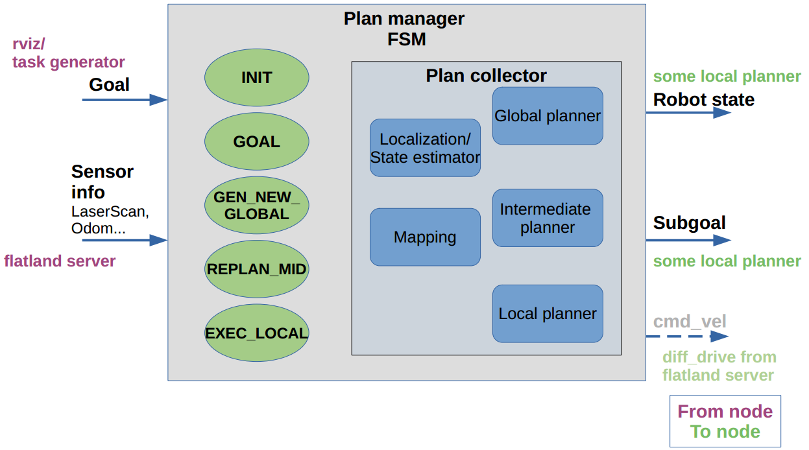
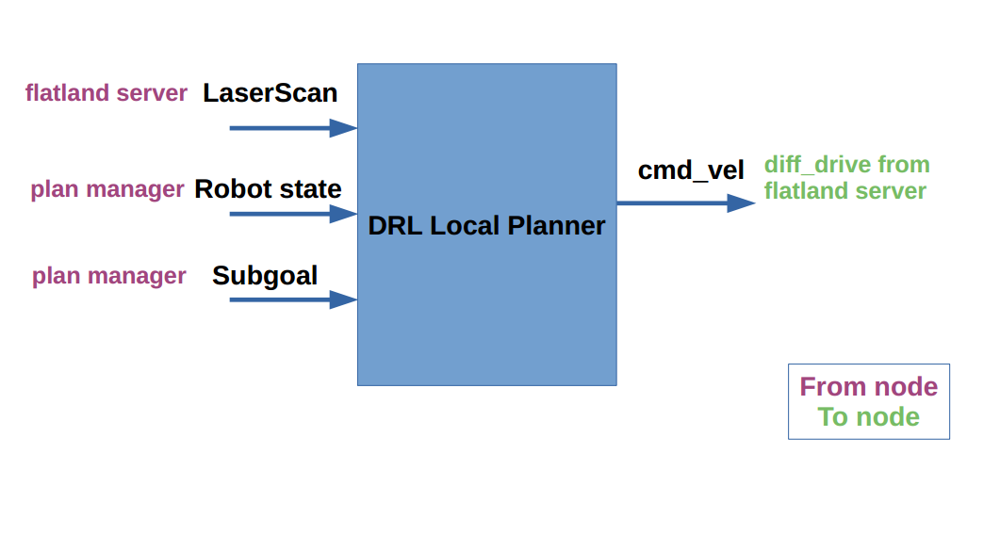
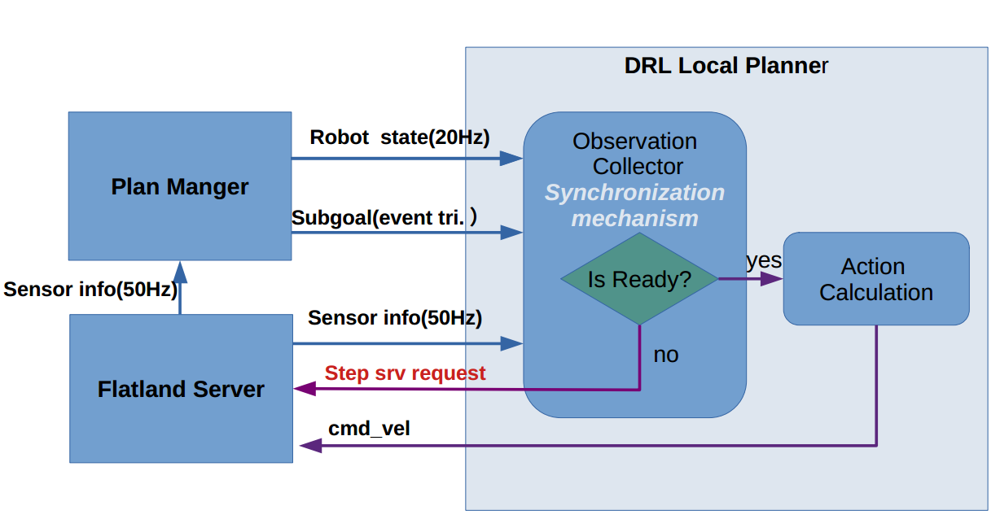

# arena-rosnav

<p align="center">
	
</p>


## 0. What is this repository for?
Train DRL agents on ROS compatible simulations for autonomous navigation in highly dynamic environments. Flatland-DRL integration is inspired by Ronja Gueldenring's work: [drl_local_planner_ros_stable_baselines](https://github.com/RGring/drl_local_planner_ros_stable_baselines.git). Test state of the art local and global planners in ROS environments both in simulation and on real hardware. Following features are included:

* Setup to train a local planner with reinforcement learning approaches from [stable baselines3](https://github.com/DLR-RM/stable-baselines3.git)

* Training in simulator [Flatland](https://github.com/avidbots/flatland) in train mode

* Local planner has been trained on static and dynamic obstacles with highly dynamic tasks

* Implementation of intermediate planner classes to combine local DRL planner with global map-based planning of ROS Navigation stack

* Integration of other obstacle avoidance approaches in ROS 

* Testing a variety of planners (learning based and model based) within specific scenarios in test mode

* Modular structure for extension of new functionalities and approaches

### Documentation & References
* How to use flatland: http://flatland-simulator.readthedocs.io
* ros navigation stack: http://wiki.ros.org/navigation
* [pedsim](https://github.com/srl-freiburg/pedsim_ros):  will be integrated https://github.com/srl-freiburg/pedsim_ros
* Full documentation and system design is released this week

## 1. Installation
#### 1.1. Standard ROS setup
(Code has been tested with ROS-melodic on Ubuntu 18.04 and Python 3.6)

* Install ROS Melodic following the steps from ros wiki:
```
http://wiki.ros.org/melodic/Installation/Ubuntu
```

* Install additional pkgs 
```
sudo apt-get update && sudo apt-get install -y \
libqt4-dev \
libopencv-dev \
liblua5.2-dev \
screen \
python3.6 \
python3.6-dev \
libpython3.6-dev \
python3-catkin-pkg-modules \
python3-rospkg-modules \
python3-empy \
python3-setuptools
ros-melodic-navigation 

```

#### 1.2. Prepare virtual environment & install python packages
To be able to use python3 with ROS, you need an virtual environment. We recommend using virtualenv & virtualenvwrapper. 

* Install virtual environment and wrapper (as root or admin! with sudo) on your local pc (without conda activated. Deactivate conda env, if you have one active)
```
sudo pip3 install --upgrade pip
sudo pip3 install virtualenv
sudo pip3 install virtualenvwrapper
which virtualenv   # should output /usr/local/bin/virtualenv  
```

* Create venv folder inside your home directory
```
cd $HOME
mkdir python_env   # create a venv folder in your home directory 
```

* Add exports into your .zshrc (if you use bash change the last line to bashrc instead of zshrc):
```
echo "export WORKON_HOME=/home/linh/python_env   #path to your venv folder
export VIRTUALENVWRAPPER_PYTHON=/usr/bin/python3   #path to your python3 
export VIRTUALENVWRAPPER_VIRTUALENV=/usr/local/bin/virtualenv
source /usr/local/bin/virtualenvwrapper.sh" >> ~/.zshrc
```

* Create a new venv
```
mkvirtualenv --python=python3.6 rosnav
workon rosnav
```

* Install packages inside your venv (venv always activated!):
```
pip install --extra-index-url https://rospypi.github.io/simple/ rospy rosbag tf tf2_ros --ignore-installed
pip install pyyaml catkin_pkg netifaces
```     

* Install stable_baselines3 for training DRL into your venv (venv always activated!)
```
pip install stable-baselines3
```


#### 1.3. Install arena-rosnav repo
* Create a catkin_ws and clone this repo into your catkin_ws 
````
cd $HOME
mkdir -p catkin_ws/src && cd catkin_ws/src
git clone https://github.com/ignc-research/arena-rosnav

cd arena-rosnav && rosws update

source $HOME/.zshrc
cd ../.. 
catkin_make -DPYTHON_EXECUTABLE=/usr/bin/python3
source devel/setup.zsh
````

* Install ros geometry2 from source(compiled with python3) 

The official ros only support tf2 with python2. In order to make the *tf* work in python3, its necessary to compile it with python3. We provided a script to automately install this
and do some additional configurations for the convenience . You can simply run it with 
```bash
./geometry2_install.sh
```
After that you can try to import tf in python3 and no error is supposed to be shown up.


## 2. Usage
Before you test out the packages, always source your setup.zsh /setup.bash inside your catkin workspace also source your $HOME/.zshrc:
```
cd $HOME/catkin_ws
source devel/setup.zsh
source $HOME/.zshrc
```

#### 2.1. [Quick start] start simulation env & plan manager
````
roslaunch arena_bringup start_arena_flatland.launch  train_mode:=false
````
start_flatland.launch will start several other sublaunch files and some neccesary ros packages:
   1. **start simulator node**: start flatland, load robot model
   2. **start map server node**: load map, which will provide occupancy grid used for mapping functions later
   3. **start fake localization**: which will provide static tf map_to_odom, in order to have localization of the robot.
   4. **start task generator node**: which provide task generation service for rviz_plugin(Generate Task)
   5. **start plan manager node**: provide manager for robot state estimation, mapping, global planner and local planner,  which is the key for navigation framework. The move_base is contained, because currently we need its global_planner and mapping functions, later they won't be needed.
   6. **/train_mode/**: 
   * if true, the simulator(flatland) will provide a *step_world service* and the simulator will update its simulation when he receives a *step_world service request*.
   * if true, the plan manager will generate subgoal topic always as goal(global goal) topic.
   * if false, you can also use move_base action triggered by rviz_plugin button *2D Navigation Goal*. 

#### 2.2. [Quick start] test DRL training

* In one terminnal

```bash
roslaunch arena_bringup start_arena_flatland.launch  train_mode:=true
```
* In another terminal

```
workon rosnav
roscd arena_local_planner_drl
python scripts/training/training_example.py
```
first **activate your python3 env**, which contains libaraies stable_baseline3, geometry2
then python run the script.

Hint: During 2021-01-05 and 2021-01-10, arena_local_planner_drl package is still under the development, which means the api of the class could be drastically changed. Sorry about the inconvinience!


#### 2.3. Rviz plugins:
   <p align="center">
      
   </p>

   1. 2D Nav Goal: triggers move_base action
   2. Spawn Model: load a new model.yaml to flatland simulator
   3. Arena Nav Goal: set (global) goal for arena navigation
   4. Generate Task: change task, which changes the position of obstacles and set a new goal for arena navigation


## 3.Design
#### 3.1. Structure of the packges
0. ./forks/flatland:(simulator)
1. arena_bringup: 
   1. config
   2. launch
      1. sublaunch:
         1. flatland_simulator.launch
         2. fake_localization.launch
         3. plan_manager.launch
         4. move_base.launch
         5. task_generator.launch
      2. start_arena_flatland.launch
   3. rviz
2. arena_navigation:
   1. fake_localization 
   2. mapping
   3. global_planner
   4. local_planner
      1. learning_based
      2. model_based
   5. plan_manager
   6. plan_msgs
3. simulator_setup: (saves flatland model files)
   1. maps
   2. obstacles
   3. robot
4. task_generator:
5. utils
   1. rviz_plugin
   2. plan_visualization


   
   
   
   
#### 3.2. Navigation framework

<p align="center">
  
</p>

#### **arena_navigation**
   1. **fake_localization**(pkg) 
   2. **mapping**:
      1. costmap2D(pkg) 
      2. Euclean Signed Distancefield Map(pkg) 
      3. Topology Graph(pkg) 
      4. Voxgraph(pkg) 
      5. ...
   3. **global_planner**
      1. arena_global_planner_Dijkstra(pkg) 
      2. arena_global_planner_Astar(pkg) 
      3. arena_global_planner_JPS(Jump point search)(pkg) 
      4. arena_global_planner_KinoAstar(pkg)  
      5. arena_global_planner_Informed_RRTstar(pkg) 
      6. ...
   4. **local_planner**
      1. learning_based
         1. arena_local_planner_drl(pkg) 
         2. arena_local_planner_cardl(pkg)
         3. ... 
      2. model_based
         1. arena_local_planner_TEB(pkg) 
         2. arena_local_planner_VFH*(pkg) 
         3. ...
   5. **plan_manager**(pkg) 
      1. plan_collector
      2. plan_manager
      3. plan_manager_node
   6. **plan_msgs**(pkg) 
      1. msg
         1. RobotState.msg
      2. srv
         1. Subgoal.srv

Plan manager
* plan_manager_node will init a ros node for plan_manager
* plan_manager is implemented as a Finite State Machine
* plan_manager is responsible for state transfer, ros communication and call plan functions from plan_collecor

Plan collector
* plan_collector has no ros communication tasks, plan_collecor only responsible for algorithms
* plan_collector calls libraries from other pkgs(e.g. pkgs in mapping, local planner, global planner) to achieve its functions
* plan_collector also responsible for subgoal generation, which is the job of intermediate planner.

Plan msgs
* saves user-defined msg or srv for arena navigation


#### 3.3. Simulator: Flatland
[Flatland](https://github.com/avidbots/flatland) is a 2D physical simulator based on box2D, which is made to be integratable with ROS and easy to extend functions with its plugin mechanism.

In our project, we have modified and extended the original Flatland source repositary in order to make it better suitable to our DRL planning purpose. The parts that have been modified will be cleared somehow in following sections.

A great introduction to flatland is listed in following website, please checi it out (most importantly in order to know how to create plugin in flatland):
* How to use flatland: http://flatland-simulator.readthedocs.io

Things need to know:
* How flatland updates its simulation progress
* How to write model .yaml files for flatland
* How to create flatland plugins(e.g. laser, driver, motion behavior) which can be added to the model .yaml file


##### How flatland updates its simulation progress
````
flatland_server/src/flatland_server_node.cpp
flatland_server/src/simulation_manager.cpp         (modified by our project)
flatland_server/src/world.cpp
flatland_server/src/timekeeper.cpp
flatland_plugins/src/laser.cpp                     (modified by our project)
````
check out these files, everything relative to simulation update is contained there.
We made some modification in *simulation_manager.cpp*, where we create a */step_world* service server.

##### How to write model .yaml files for flatland
Robot, Obstacles and world can be described by .yaml files, which provide easy setting to users.

check out the model section in http://flatland-simulator.readthedocs.io

##### How to create flatland plugins
Sensors such as laser, actuator such ad diff_driver & other user defined motion behaviors can be coded as a flatland plugin and added to the model .yaml file.

check out the plugin section in http://flatland-simulator.readthedocs.io

````
flatland_plugins/src/laser.cpp                     (modified by our project)
flatland_plugins/src/diff_drive.cpp                (modified by our project)
flatland_plugins/src/model_tf_publisher.cpp        (modified by our project)
flatland_plugins/include/flatland_plugins/tween.h  (for dynamic obstacle motion behavior)
flatland_plugins/include/flatland_plugins/update_timer.h
````
These are the plugins that currently we are using and some of them are modified.

Modification are mostly done in these two functions in each plugins.
These change are made intended to make the publication of topics done in *AfterPhysicsStep* otherthan in *BeforePhysicsStep*.

````
void BeforePhysicsStep(const Timekeeper& timekeeper);
void AfterPhysicsStep(const Timekeeper &timekeeper) ;
````

#### 3.4. Task Generator
To be added...

### 8. DRL Local planner(Training and Testing)
<p align="center">
  
  
</p>

##### Communication:
DRL local planner get the needed observation info by using ROS communication. This may slows down the training, but for current version we just keep it.

DRL local planner get observation info from:
   * flatland server: laser scan
   * plan manager: robot state, subgoal

DRL local planner send action command to flatland server
   * flatland server: diff_drive

##### Observation synchronization
DRL local planner contains observation collector and we designed a synchronization mechanism for following important reasons & aspects:
   1. In real world, each sensor has its own publishing rate and are different from each other
   2. The action calculation should based on the observations that are synchronized, otherwise is useless.
   3. The calculated action is only valid for a specified time horizon(control horizon),e.g. 0.2s. For different control horizon, the action space should be different. 
      1. example 1: action is calculated every 0.01s, time horizon=0.01s, suppose calculated action=1m/s, in this time horizon the robot will actually move 0.01m.
      2. example 2: action is calculated every 0.5s, time horizon=0.5s, suppose calculated action=1m/s, in this time horizon the robot will actually move 0.5m.
      * From 1 & 2, one can see for a same action space, a different time horizon will result in different actual result.


To be added...

#### 3.5. Utils
contains rviz_plugins & planning visulizations needed to be showed in rviz.

