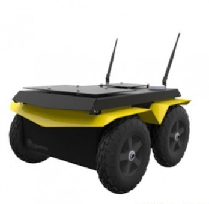
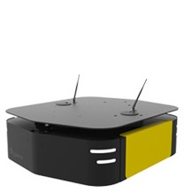
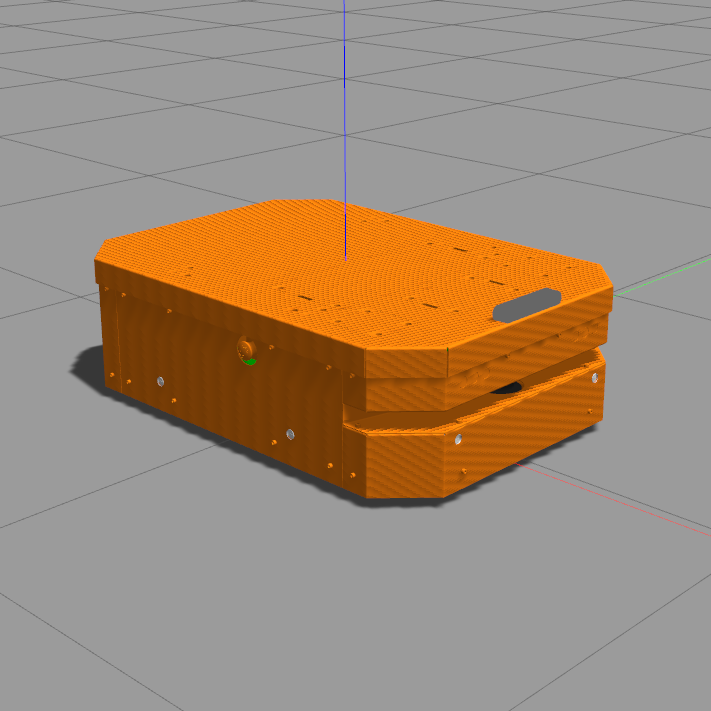
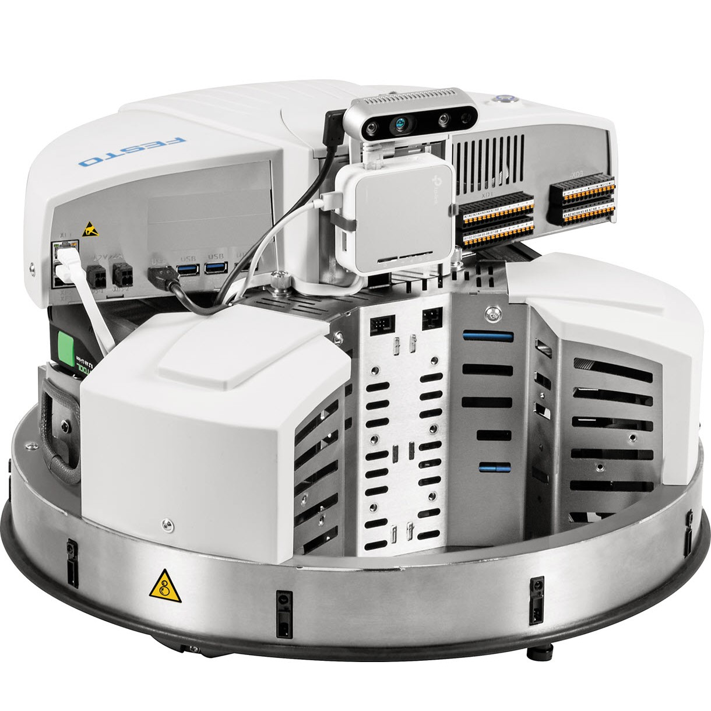
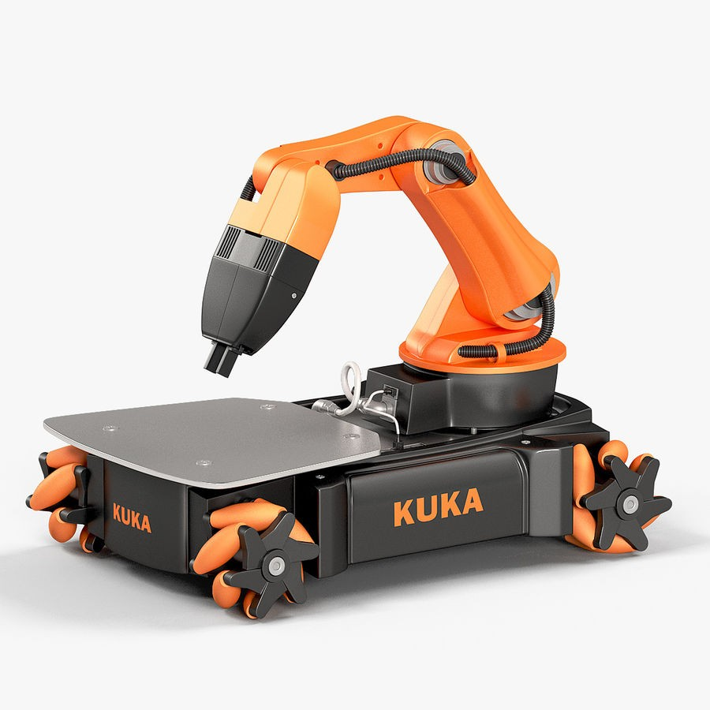
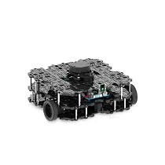
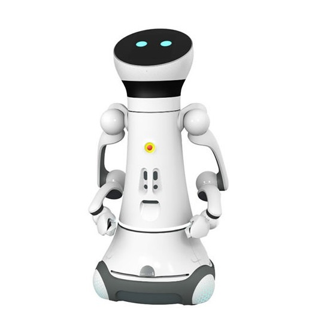

# Arena-Rosnav (IEEE IROS 21)
If you find this code useful, please cite our paper:
```
@inproceedings{kastner2021arena,
  title={Arena-Rosnav: Towards Deployment of Deep-Reinforcement-Learning-Based Obstacle Avoidance into Conventional Autonomous Navigation Systems},
  author={K{\"a}stner, Linh and Buiyan, Teham and Jiao, Lei and Le, Tuan Anh and Zhao, Xinlin and Shen, Zhengcheng and Lambrecht, Jens},
  booktitle={2021 IEEE/RSJ International Conference on Intelligent Robots and Systems (IROS)},
  pages={6456--6463},
  organization={IEEE}
}
```

**Note:**
This reporsitory is part of [arena-bench](https://github.com/ignc-research/arena-bench). Please also check out our most recent [paper](https://arxiv.org/abs/2206.05728) on arena-bench. For our 3D version using Gazebo as simulation platform, please visit our [arena-rosnav-3D repo](https://github.com/ignc-research/arena-rosnav-3D). 


This reporsitory includes the code for our paper [Arena-rosnav](https://arxiv.org/abs/2104.03616). Arena-rosnav is a flexible, high-performance 2D simulator with configurable agents, multiple sensors, and benchmark scenarios for testing robotic navigation. Arena-Rosnav uses Flatland as the core simulator and is a modular high-level library for end-to-end experiments in embodied AI -- defining embodied AI tasks (e.g. navigation, obstacle avoidance, behavior cloning), training agents (via imitation or reinforcement learning, or no learning at all using conventional approaches like DWA, TEB or MPC), and benchmarking their performance on the defined tasks using standard metrics.

|  |  |
| :---------------------------------------------------: | :---------------------------------------------------: |
|                   _Training Stage_                    |                  _Deployment Stage_                   |


## What is this repository for?

Train DRL agents on ROS compatible simulations for autonomous navigation in highly dynamic environments. Flatland-DRL integration is inspired by Ronja Gueldenring's work: [drl_local_planner_ros_stable_baselines](https://github.com/RGring/drl_local_planner_ros_stable_baselines.git). Test state of the art local and global planners in ROS environments both in simulation and on real hardware. Following features are included:

- Setup to train a local planner with reinforcement learning approaches from [stable baselines3](https://github.com/DLR-RM/stable-baselines3.git)
- Training in simulator [Flatland](https://github.com/avidbots/flatland) in train mode
- Include realistic behavior patterns and semantic states of obstacles (speaking, running, etc.)
- Include different obstacles classes (other robots, vehicles, types of persons, etc.)
- Implementation of intermediate planner classes to combine local DRL planner with global map-based planning of ROS Navigation stack
- Testing a variety of planners (learning based and model based) within specific scenarios in test mode
- Modular structure for extension of new functionalities and approaches

## Start Guide

We recommend starting with the [start guide](https://github.com/ignc-research/arena-rosnav/blob/local_planner_subgoalmode/docs/guide.md) which contains all information you need to know to start off with this project including installation on **Linux and Windows** as well as tutorials to start with.

- For Mac, please refer to our [Docker](https://github.com/ignc-research/arena-rosnav/blob/local_planner_subgoalmode/docs/Docker.md).

## 1. Installation

Open the terminal with `Ctrl`+`Alt`+`T` and enter below commands one at a time.

In order to check the details of the easy installation script, please refer to the [script file](https://raw.githubusercontent.com/ignc-research/arena-rosnav/noetic-devel/setup.sh).

```bash
sudo apt-get update && sudo apt-get upgrade
wget https://raw.githubusercontent.com/ignc-research/arena-rosnav/noetic-devel/setup.sh -O - | bash
```

Create a virtual environment

```bash
source ~/.bashrc && mkvirtualenv --python=python3.8 rosnav
```

Install further dependencies (you can take a look at the script [here](https://raw.githubusercontent.com/ignc-research/arena-rosnav/noetic-devel/setup2.sh))

```bash
wget https://raw.githubusercontent.com/ignc-research/arena-rosnav/noetic-devel/setup2.sh -O - | bash
source ~/.bashrc && workon rosnav
```

Now everything should be set up. You can start the simulation with:

```bash
roslaunch arena_bringup start_arena_flatland.launch
```

Alternatively, refer to [Installation.md](docs/Installation.md) for detailed explanations about the installation process.

## 1.1. Docker

We provide a Docker file to run our code on other operating systems. Please refer to [Docker.md](docs/Docker.md) for more information.

## 2. Usage

### DRL Training

Please refer to [DRL-Overview.md](docs/DRL_overview.md) for detailed explanations about agent, policy, and training setup. Addtionally, useful tips and information about the training are provided.

### Scenario Creation with [arena-tools](https://github.com/ignc-research/arena-tools/)

To create complex, collaborative scenarios for training and/or evaluation purposes, please refer to the repo [arena-tools](https://github.com/ignc-research/arena-tools). This application provides you with an user interface to easily create complex scenarios with multiple dynamic and static obstacles by drawing and other simple UI elements like dragging and dropping. This will save you a lot of time in creating complex scenarios for you individual use cases.

### Robots

We support different robots:
|||||
|:--: | :--:| :--:| :--:|
| _turtlebot3_burger_ | _jackal_ | _ridgeback_ | _agv-ota_ |

|  |  |  |  |
| :------------------------------------------: | :---------------------------------------------: | :------------------------------------------------------------: | :-------------------------------------------: |
|               _Robotino(rto)_                |                    _youbot_                     |                     _turtlebot3_waffle_pi_                     |              _Car-O-Bot4 (cob4)_              |

All robots are equipped with a laser scanner. The robots differ in size, laser-range etc. See below table for more detailed information on each robot:

| Name                   | Max Speed (v*x) [\_m/s*] | Max Speed (v*y) [\_m/s*] | Max Rotational Speed (θ*y) [\_rad/s*] | Radius [_m_] | Emergency-Stop¹ | Laser-range [_m_] | Holonomic² |
| :--------------------- | :----------------------: | :----------------------: | :-----------------------------------: | :----------: | :-------------: | :---------------: | :--------: |
| _turtlebot3-burger_    |           0.22           |           0.0            |                 2.84                  |    0.113     |      True       |        3.5        |   False    |
| _jackal_               |           2.0            |           0.0            |                  4.0                  |    0.267     |      True       |       30.0        |   False    |
| _ridgeback_            |           1.1            |           0.5            |                  2.0                  |    0.625     |      True       |       10.0        |    True    |
| _agv-ota_              |           0.5            |           0.0            |                  0.4                  |    0.629     |      True       |        5.0        |   False    |
| _rto_                  |           2.78           |           2.78           |                  1.0                  |    0.225     |      False      |        5.6        |    True    |
| _youbot_               |           0.8            |           0.8            |                  1.2                  |    0.347     |      False      |        5.6        |    True    |
| _turtlebot3_waffle_pi_ |           0.26           |           0.0            |                 1.82                  |    0.208     |      False      |        3.5        |   False    |
| _Car-O-Bot4 (cob4)_    |           1.1            |           0.2            |                  0.8                  |     0.36     |      True       |       29.5        |    True    |

For additional / more detailed information about each robot:

- [See the parameters needed for the **Navigation stack**](arena_navigation/arena_local_planer/model_based/conventional/config)
- [See additional robot parameters like laser min/max [_rad_]](https://github.com/ignc-research/arena-rosnav-3D/wiki/Laser-scanner-parameters)
- See [_HERE_](arena_navigation/arena_local_planer/learning_based/arena_local_planner_drl/configs) for the definition of the robots action_spaces (needed for rl-based-training)

# IROS21 information

To test the code and reproduce the experiments, follow the installation steps in [Installation.md](https://github.com/ignc-research/arena-rosnav/blob/local_planner_subgoalmode/docs/Installation.md). Afterwards, follow the steps in [Evaluations.md](https://github.com/ignc-research/arena-rosnav/blob/local_planner_subgoalmode/docs/Evaluations.md).

To test the different **Waypoint Generators**, follow the steps in [waypoint_eval.md](https://github.com/ignc-research/arena-rosnav/blob/local_planner_subgoalmode/docs/eval_28032021.md)

**DRL agents** are located in the [agents folder](https://github.com/ignc-research/arena-rosnav/tree/local_planner_subgoalmode/arena_navigation/arena_local_planner/learning_based/arena_local_planner_drl/agents).

# Used third party repos:

- Flatland: http://flatland-simulator.readthedocs.io
- ROS navigation stack: http://wiki.ros.org/navigation
- Pedsim: https://github.com/srl-freiburg/pedsim_ros
