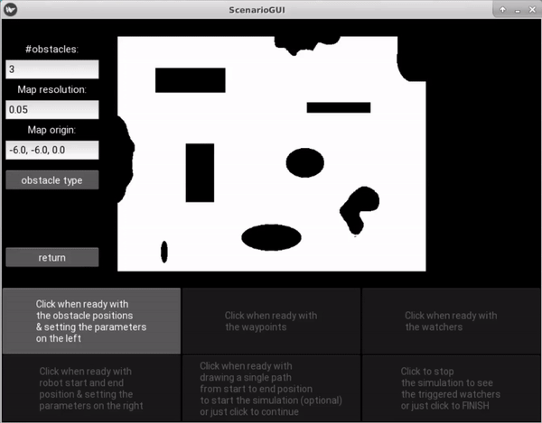
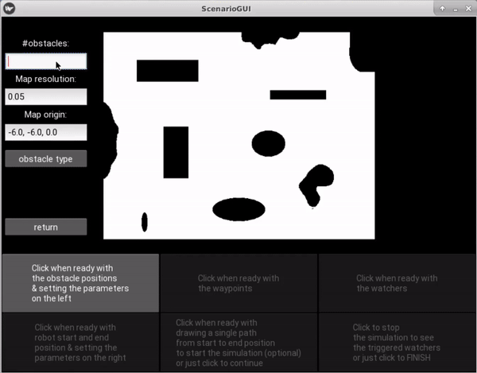
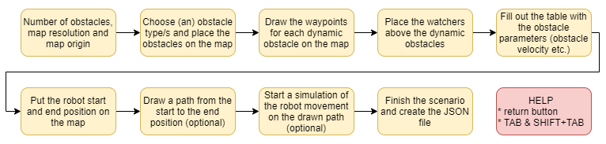
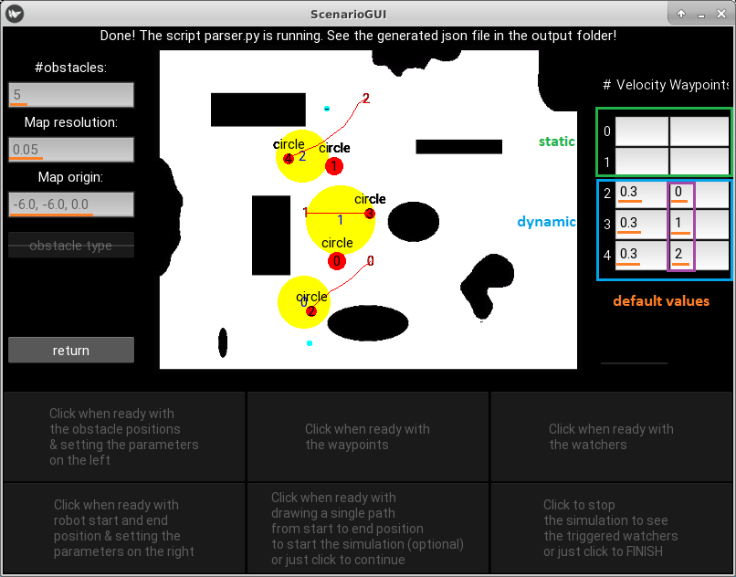

# Drawing panel for designing scenarios easily

### Overview
The GUI represents an user interface for creating scenarios more intuitive, a lot faster and in a much simpler way. The generated Kivy-App is not only easy to install, set up and run, but also easy to modify and extend. It was already positive evaluated during a big evaluation run, where certain approaches were tested on 100 different scenarios, created correctly from the GUI within only a couple of hours. Using the GUI for the first time without reading its rules is of course possible, but may not be enough to use its entire potential. Using it after reading the rules should be pretty much straight-forward. But using the App after reading also the small tips, written in this documentation should allow the user to create a scenario every time even faster and faster.

|  |  |
|:--:| :--:| 
| *Scenario with 3 dynamic obstacles* | *Scenario with 20 dynamic obstacles* |

### Requirements
1. Install Ubuntu 18.04.
2. Install [Kivy](https://kivy.org/doc/stable/gettingstarted/installation.html#install-pip).  
`$ python -m pip install --upgrade pip setuptools virtualenv`  
`$ python -m virtualenv kivy_venv`  
`$ source $HOME/kivy_venv/bin/activate`  
`$ python -m pip install kivy[base] kivy_examples`
3. Clone the whole project.
4. (if needed) install/update Pillow  
`$ python -m pip install --upgrade Pillow`
5. (if needed) install xclip  
`$ sudo apt-get install xclip`
6. (optional) if you want to support the `SHIFT+TAB` behaviour to jump backwards from text field to another, change in the file `$HOME/kivy_venv/lib/python-{version}/site-packages/kivy/uix/behaviors/focus.py` in function `keyboard_on_key_down()` `['shift']` to `{'shift'}`  
**Attention:** Depending on the Python version that you are using, you may have to run the operations above with for example `python3` insteed of `python`!

### How to run
1. Upload an image of the map in the `input` folder inside of the root folder.
2. Activate the kivy environment.  
`$ source $HOME/kivy_venv/bin/activate`
3. Navigate inside the project root folder.  
`$ cd arena-rosnav/gui`
4. Execute the `paint.py` file.  
`$ python paint.py`
5. Generate a new scenario in the paint app. Look at the rules! When ready, the next script `parser.py` will automatically start.  
6. The generated json file will be saved under the name `new_scenario.json` in the `output` folder as well as in the folder `arena-rosnav/simulator_setup/scenerios/`, where all scenarios are stored.
7. Modify the `arena-rosnav/arena_bringup/launch/sublaunch/task_generator.launch` file, changing the name of the expected json file to `new_scenario.json`.  
8. Activate rosnav.  
`$ workon rosnav`  
**Attention:** Rosnav and kivy_env might not be able to stay active at the same time, so activate kivy_env for the gui and rosnav for launching.
8. In `arena-rosnav` run for example  
`$ roslaunch arena_bringup start_arena_flatland.launch local_planner:="teb" use_viz:="true" map_file:="map1" rviz_file:="nav2"`.  
The file `nav2.rviz` is different from `nav.rviz` only by two things - the map is horizontal and the first couple of obstacles are visible with the start of rviz. The program still works will all available rviz files, just the visualization will be slightly defferent. Make sure also that the map (`.png` file, `.yaml` file etc.), here `map1` is in the folder `../simulator_setup/maps`. Please take a look at the section `Legend for the already tested maps` below.

### Folder structure
1. The root folder consist of both executable files `paint.py` and `parser.py`, as well as the `README.md` file.
2. The folder `input` inside of the root folder should be filled by the user before starting the program with the image of the map, for which scenarios have to be designed.  
**Attention:** Do not forget to adjust the name of the new map in the `paint.py` file!
3. The folder `output` inside of the root folder will be empty at first, but after the file `paint.py` has been run, it will fill with data and images from the painting program, as well as with the sub-folder `internal`. As the name says, the data and images from the sub-folder will be used for internal use from the files `paint.py` and `parser.py`. The output will be stored in the folder `output` itself. It will contain the generated json file `(new_scenario.json)`, the relevant to the user data such as map resolution etc. `(user_data.txt)` and a screenshot from the generated scenario without `(scenario.png)` and with the simulation `(scenario_sim.png)`.
4. The folder `math` consists of diagrams explaining the solution of different math problems.
5. The folder `media` consists of screenshots and videos for different test rounds to give the user the feeling how a scenario should look like and to prove that the program works correctly. Most important it also consists of tutorial videos about how to use the gui.
6. The folder `examples` consists of the saved data after creating different scenarios with the gui. It consists of the `internal` folder, if the parser should be run again and of the json file as well as other useful data for the user to directly use the scenario as it is.
7. The folder `eval_scenarios` consists of example scenarios with difficult maps and a lot of obstacles for evaluation runs.

### Rules for using the paint program

  

1. The first thing to do is to set the number of obstacles, the resolution and the origin of the uploaded map.

2. From the dropdown button on the left the obstacle type should be chosen. If nothing has been selected, the default type 'circle' (in red) will be used. After that obstacles in form of circles with different colors (types) could be placed with a mouse click on the map. To change the position of the current obstacle, the clicked mouse could be moved in all directions, but only on the map. To change the radius of the obstacle, while the mouse is still clicked, the '+' and '-' button from the keyboard could be used to make it bigger or smaller. To see the changes, the mouse should be moved slightly to trigger the event. In the center of the new obstacle will appear an index, with which the obstacle will be saved. Different types of obstacles are supported in the same scenario.

3.  When ready with the obstacles and setting the parameters on the left (number of obstacles, map resolution and origin), click on the first button on the bottom left. From now on with mouse click and drag could be drawn lines. These lines represent the trajectory of the obstacles. The start of each line will not be considered, since it always should be at the center of an obstacle. But the end of the line is important, since there will be the end point of the movement of the dynamic obstacle. To be able to draw multiple waypoints per obstacle and not to be restricted by the order, in which they should be drawn, the dynamically generated by the number of obstacles table on the right should be filled. In the same table should be also given the velocity for each obstacle, its watchers, as well as its motion. The legend of the table per line from left to right is: obstacle index (already given, look at the map) - obstacle velocity - watcher indices for this obstacle (to separate multiple watchers use comma without spaces in between -> example: '1,2') - waypoint indices for this obstacle (the same as the watcher indices) - motion for this obstacle (example 'yoyo'). Depending on the used obstacle types there could be even more parameters to be set. If in the table for a certain obstacle the text field under "waypoints" is empty, the obstacle will be considered as static.

4. When ready with the lines (waypoints), click on the second button on the bottom. From this point on the map could be positioned again with a mouse click watchers. Here apply the same rules for drawing as the ones for the obstacles. To assign the watchers to the obstacles their indices per obstacle should be also written in the scrollable area on the right.

5. When ready with the watchers, click on the next button and on the map could be clicked the start and position of the robot. It could be clicked only twice and the first click should be for the start position. The radius of the robot will be automatically set and can not be changed. At this point is also your last chance to make any changes to the parameters on the right.

6. When ready with the robot positions and filling up the rest of the data on the right, click on the next button. From this point forward a path could be drawn with a mouse click & move from the start to the end point. Drawing the path is optional. If you want to skip this step, just click the last two buttons one after another and the scenario will be finished. If you want to draw the path, do it and read step 7. Only one path could be drawn per scenario.

7. If you have drawn a path in the previous step, clicking the next button will start a small simulation of the movement of the robot on the drawn path. The robot will move with the same velocity here in the gui as it will move later on in the simulation environment in rviz. While the robot is moving, if it overlaps with a watcher, the watcher will be instantly marked dark red. If you wait until the robot reaches the end point, you can see exactly which watchers have been triggered. Once the robot reaches the end point, the simulation will restart. You can stop it at any point by clicking on the last button, confirming that the scenario is done.

8. When ready with looking at the simulation and the triggered watchers (if watchers were used), click on the last button to confirm that the scenario is now ready. No changes could be further made. The information from the paint app will be saved in files in the `output` folder. The information saved is still rough, so another python script `parser.py` will be automatically started. It will generate a json file for the just drawn scenario. The script could be of course also run separately after the scenario, if some changes should be made to the json file without changing the scenario, since all important information from the scenario is saved in the output folder.

9. For drawing on the map only the left mouse click should be used. The mouse wheel is disabled, still right click and wheel button could visualize figures. However, they will not be considered. Pay attention that they will be visualized with slightly different color and will not get an index. So remember only to use the left click of the mouse, to not make the map crowded.

10. To make the user experience easier, there is a 'return' button. While placing the obstacles, the watchers, the waypoints, the robot positions or drawing the path you can click on the button and you can start from the beginning of the current section. For example if you are currently placing the watchers and you make a mistake, you can click on 'return' and you can start over with placing the watchers, without deleting the obstacles. Once you move forward to the waypoints, the watchers can not be changed anymore - if there is still a mistake, the program should be started from the beginning. Be careful with the 'return' button while placing the obstacles. Since there are multiple available obstacle types, once you change the type of the obstacle to another, the obstacles from the first type can not be deleted anymore. The 'return' button will give you the chance to start over only with the current obstacle type.

11. From one text field to another can be jumped forwards pressing `TAB` and backwards pressing `SHIFT+TAB`. The scrollable area will also automatically scroll, so that the currently focused text field is visible. This makes the setup of parameters easier and faster.

### Cheat sheet for creating a huge amount of scenarios
1. It is recommended for complicated scenarios to first draw them on paper and after that a lot quicker on the gui. You will be a lot faster that way and the chance of making a mistake and starting all over again is a lot smaller.
2. If you want to create obstacles with radius between X_rviz and Y_rviz in meter -> you need to calculate X_gui and Y_gui in px to know how big to make the obstacle on the gui:  
Calculate `X_gui = X_rviz / (scale * map_resolution)` and `Y_gui = Y_rviz / (scale * map_resolution)` with `map_resolution` = user input, depending on the map and `scale` = different for each map, calculated intern after the map image has been uploaded on the gui. After running `paint.py` its value could be checked in the intern txt file `data.txt` under 'positions scale' (the first value on the left).  
For example with `map_resolution` = 0.05, `scale` = 1.0, `X_rviz` = 0.3m and `Y_rviz` = 0.5m => `X_gui` = 6 px and `Y_gui` = 10 px (default obstacle radius is 10 px).
3. The obstacle velocity does not have to be scaled. Just put it as you want it to be later on in rviz in the corresponding text input field (example: for 0.3m/s put 0.3).
4. Do not forget to load the right image of the map (change the global variable `scenario_map`) and to check out the corresponding map origin and map resolution from the yaml file to input them later on correctly on the gui. If you plan to use the map a lot, you can also change their global default parameters `map_resolution_default` and `map_origin_default`.
5. You can change the default value of every text input on the gui, as well as of the radius of the obstacles and watchers with the corresponding global variables on top of the `paint.py` script. You can even specify the number of static and dynamic obstacles, so that some of the fields are filled directly correct for you with starting the program, saving you a lot of time. For this is important to remember, to always start with placing the static obstacles on the map and then continue with the dynamic ones.
6. If you want to create multiple complicated scenarios where only one thing is different, you can create only one complicated scenario and then multiple easy, almost empty ones, where only the part that is different is generated and then from the resulted json file copy-paste the difference into the complicated scenario.

|  | scenario_map = 'input/all_maps/map1.png'   number_obstacles_default = '5'   map_resolution_default = '0.05'   map_origin_default = '-6.0, -6.0, 0.0'   obstacle_vel_default = '0.3' # in m/s   obstacle_motion_default = 'yoyo'   obstacle_radius_default = 10.0 # in px  watcher_radius_default = 25.0 # in px  number_static_obstacles_default = 2   number_dynamic_obstacles_default = 3 |
|:--:| :--| 
| *Example scenario with both static and dynamic obstacles* | *Default parameters for easier creation* |

### Legend for the already used maps

Ros launch with the flag `map_file:="<map_name>"`. For example for `map1` use `map_file:="map1"`. Make sure that the maps (`.png` file, `.yaml` file etc.) are in the folder `../simulator_setup/maps`.

| Map                      | Resolution  | Origin (x,y)   |
| ------------------------ | ----------- | -------------- |
| map1 **                  | 0.05        | (-6.0, -6.0)   |
| map_middle_complexity ** | 0.05        | (0.0, 0.0)     |
| map0                     | 0.05        | (-16.6, -6.65) |
| map_empty *              | 0.05        | (-6.0, -6.0)   |
| map_empty_small (*)      | 0.05        | (-6.0, -6.0)   |
| map_small *              | 0.027       | (-6.0, -6.0)   |
| complex_map_1            | 0.05        | (0.0, 0.0)     |
| complex_map_2            | 0.05        | (0.0, 0.0)     |
| complex_map_3            | 0.05        | (0.0, 0.0)     |
| corridor_1               | 0.05        | (0.0, 0.0)     |
| corridor_2               | 0.05        | (0.0, 0.0)     |
| corridor_3               | 0.05        | (0.0, 0.0)     |
| open_field_1             | 0.05        | (0.0, 0.0)     |
| open_field_2             | 0.05        | (0.0, 0.0)     |
| open_field_3             | 0.05        | (0.0, 0.0)     |

### Overview for working on different operation systems
#### (only for running this scenario gui, not the whole project!)

1. Ubuntu OR Windows with WSL2 + GUI support  
`$ source kivy_venv/bin/activate`  
`$ cd arena-rosnav/gui/`  
`$ python paint.py`  
`$ python parser.py`  

2. Windows from git bash  
`$ source kivy_venv/Scripts/activate`  
`$ cd arena-rosnav/gui`  
`$ python paint.py` (move the black window a little bit to the bottom and back to make everything visible)  
`$ python parser.py` (if everything is correct, the data will be corectly written and saved, but if something is wrong, the program will terminate as it should do, but without showing the corresponding messages)  

3. Windows from cmd  
`$ kivy_venv\Scripts\activate`  
`$ cd arena-rosnav\gui`  
`$ python paint.py` (move the black window a little bit to the bottom and back to make everything visible)  
`$ python parser.py`   
**Attention:** Depending on the Python version that you are using, you may have to run the operations above with for example `python3` insteed of `python`!

### Tips and brief explanations for future developers how to modify/extend the program

1. For now there is no automation available for the steps that need to be done in the gui to create a scenario. Still, for every single parameter is already given a default value so that the creation could be made faster. For some of the default values are used global variables, so that they can be easily changed for for example big evaluation runs. The variables like `scenario_map`, `number_obstacles_default` and so on are easy to find, declared on top of the `paint.py` script.  
Still, to become the json file at the end all steps and no mistakes should be done on the gui. If you want to create a huge amount of scenarios with small differences (excluding parameter values), there is one more thing you can do to 'cheat' the pipeline and be a lot faster. Let's say the only difference that you have for a couple of scenarios is the robot start and end position. You do not need to create every single scenario separately. You can create one and for the next few you will only need the different robot positions. For that you can fast create a simple scenario using all default values and changing only the robot positions so that you can become the json file at the end, from where you can copy the positions and paste them to the bigger scenario. Please be careful with the data in  the `output/internal` sub-folder. As you know the txt files there consists of the data from the gui. You may say that you can just create invalid, almost empty scenario with just the robot positions and then look inside of the robot.txt file and get the positions from there. Pay attention that those positions are not scaled yet and will not be right. Of course you can scale the positions by yourself manually, if you know how and you are sure that the scale is correct. After you have created a couple of scenarios, you will get a better understanding of how it works and how to create scenarios even faster.

2. To scale the map as you see it in the gui to the map in rviz is one of the most important things. The following things were considered:
    * The map on the gui is uploaded from a .png file, so the first thing to know is the size of this original image.
    * The map is positioned in a certain area in the gui. The dimensions of the area should be also known.
    * When uploading the map, the map will automatically scale, so that it fills the area in the best way. The new dimensions (width and height) of the map on the gui, as well as its four corners should be manually calculated. Its new starting point (bottom left corner) is the most important point.
    * Another thing is considering the given on the textinput field map resolution and map origin, if it is different then (0.0,0.0).
 
   So all steps for scaling the map as well as all positions and distances are:  
   

    
   

   
   Example:  
   `radius_gui * scale * map_resolution = radius_rviz` with `map_resolution` = user input, depending on the map and `scale` = different for each map, calculated intern after the map image has been uploaded on the gui; after running `paint.py` its value could be checked in the intern txt file `data.txt` under 'positions scale' (the first value on the left).

3. To add additional obstacle type or to remove already existing one from the dropdown button search in `paint.py` for `dropdown_obstacle_type`. From there delete a button or create a new one and bind it to the dropdown button. A new button will need a callback function, where a new color for its visualization should be defined. A pair of obstacle type and its RGB color should be also added to the global array `obstacle_type`. In addition to the color change, also the obstacle type name could be written above the obstacle. If you think that this makes the map too crowded, you can only make a test run, where you put on the map an obstacle from each type with the name above it and save this as an image to show the user all obstacle color-types pairs and then comment out the names. This happens in the function `on_touch_up()` inside of the obstacle widget `MyPaintWidgetCircleObstacle`.

4. If new widgets for drawing additional behavior on the map should be included, the following things should be considered.  
    * After each step, after adding every new drawing widget, all drawings on the map until this point are saved as an image. Then the new widget is added, as well as the current situation, but as an image. This is needed, since all drawing widgets are controlled from the mouse (and some of them also from the keyboard) and once the new widget overtakes this power from the previous one, everything drawn from the previous widget gets deleted. So saving the current status as an image avoids data loss, but also prevents from controlling activity in the past. That is also why the return button has a limited power.

    * Since everything at some point is saved as an image, the data from each drawing widget should be saved to a txt file before losing the data - so while the user is working with the program and not at the end. Those files are not only used later on for `parser.py`, but also intern in `paint.py`. When for example the number of obstacles is needed, the lines in `output/obstacle.txt` are calculated etc.

    * Another possible issue is visualizing the new widget at the right moment. When multiple widgets are added one after another, every new widget is going to be visualized on top of the previous one. That is why the map should be always added first etc. So if you design a new widget and add it, but do not see it, there is good chance that it is there, but under some other widgets, so check carefully.

    * The `output/internal` folder is already used to save the temporary images, right before adding a new widget. Use further this strategy and check those images, so that you are sure that only the drawing widgets up until now are exported and later on imported again. If everything from the window is saved, buttons for example will not act ever again as buttons, since they will be just a part of an image.

5. To add or remove obstacle parameters you should pay attention to the following things. All parameters are visible after the obstacles are already drawn, so after the first button is clicked (see the callback function `button_callback()`). Since the area with the parameters is dynamically generated, based on the number of obstacles given, a list is used for each obstacle parameter (for example `textinput_desire_force_factor[]`). These lists are generated in the main function `parent_widget()` and passed all trough the function `set_obstacle_params()`, which generates the scrollable area for the parameters. This is the function that you need to extend. First you need to generate a label for the new parameter, then in the loop to generate a text input for each obstacle (do not forget to bind the new text input to the `on_focus()` function, so that it is always visible when focused) and last, but not least to adjust the number of columns of the layout. Furthermore you have to decide if this new parameter should be always visible or only under a condition. The area is made scrollable to both up-down and left-right directions, so adding more parameters or deleting some in the future should not mess up with the overall layout. When a new parameter is added, its data should also be saved. Saving the data from the scrollable area happens after the last button is pushed (see its callback function `button4_callback()`). There the data from the new parameter should be saved to for example `data.txt`, from where it should be read in `parser.py` and later on written in the right form in the json file.

6. For understanding the simulation of the robot movement a couple of things are important.  
    * While the user draws the path, Kivy saves its positions, but only in the beginning, at the end and in between, but only when the mouse is moved. This means that a lot of gaps with different distances appear in between the saved positions. These gaps should be filled out, so that the robot does not jump from one place to another, but to smoothly move forwards. For this to be done, additional calculated points between every pair of saved positions were added, so that the constant distance D is always when possible the distance between every two points (no matter old or new). The mathematical calculations that were made can be seen in `extended_positions_on_the_path_calculation.png` in the `math` sub-folder.

    * The robot on the simulation moves from one point to another for the same time in the gui as in rviz. The robot velocity in rviz is hard coded to 0.3m/s. The distance D between two points on the drawn path is in px. Using a scale the distance was transformed in m for the map in rviz. This distance D_rviz, divided to the hard coded velocity v_rviz, gives us the time t, for which a robot moves from one point to another. This time should be the same in the gui and in rviz. That is how it was calculated, with what delay (= time t) the robot should appear on the next point on the drawn path.

    * Regarding how it was detected that the robot overlaps with a watcher, the mathematical equation and following condition can be seen in `watcher_area_calculation.png` in the `math` sub-folder. The radius of the robot in the gui was again calculated, regarding the fact that its radius in rviz is hard coded to 0.2m.

7. For now the window is made unresizable. It is not hard to make it resizable, but it is tricky to make the size of each widget to resize properly and at the right moment. This is very important for the scale calculations, which are made to be able to scale the size of the original image of the map to the imported one. If for example the width of the original image is bigger then the space provided for importing it, it will automatically scale, so the new size should be found manually. All of this is taken care of for an unresizable window, but pay attention to this, when developing a resizable window. Some initial steps are already done in the code.

8. The user is restricted to draw only on the map. This is done with restricting the mouse and keyboard events only inside the borders of the calculated new size of the imported map. This is important, since otherwise an obstacle etc. will be drawn, when a button is clicked and the text areas will not be usable. Since the mouse has a moving behavior, it is important not only to check where the mouse starts its moving, but its position during all its motion. If after your implementation, an error occurrs, after you clicked somewhere on the map, the most possible reason is that the boundaries for the mouse event have not been taken into consideration after the changes.

9. For future development it could be considered to improve the behavior of the return button, to be able to return only one mouse click and not a whole session. A possible way could be to save a temporary image of all drawing widgets after each click. This could allow returning one click, but still only one.

10. It is also important, to restrict until which point of the designing the scenario which features should be already given by the user and must not be changed afterwards etc., so to control the flow of the process. For now this is done by enabling/disabling some widgets (buttons etc.) after a certain event has been triggered.

11. For setting the motion (yoyo, circle etc.) for each obstacle for now are used dynamically generated text fields. Since new types of motions could be added in the future, this is the more simpler way to add them by just writing the new type inside of the field. Of course to make it more secure, it should be checked, if what is written inside is a valid motion type or not. This is made inside of the script `parser.py` before creating the json file. In an array are saved valid motion types and the given types are checked if they are on the list. So to add new types, this array should be extended, otherwise the program will terminate. Another way to take care of the motion of each obstacle is by dynamically creating dropdown buttons. Up until now was no way found to do this dynamically without knowing how much obstacles are there in the beginning. The problem is that the names of all dropdown buttons and buttons inside should be different and fixed for the whole program, because otherwise the binding will not work. A temporary solution was implemented - the number of obstacles was restricted up until 20 and all possibilities from 0 to 20 obstacles were hard coded. This solution is still in the code (commented out), if in the future this method with dropdown buttons is tried again. So for now we stick with the text fields.
